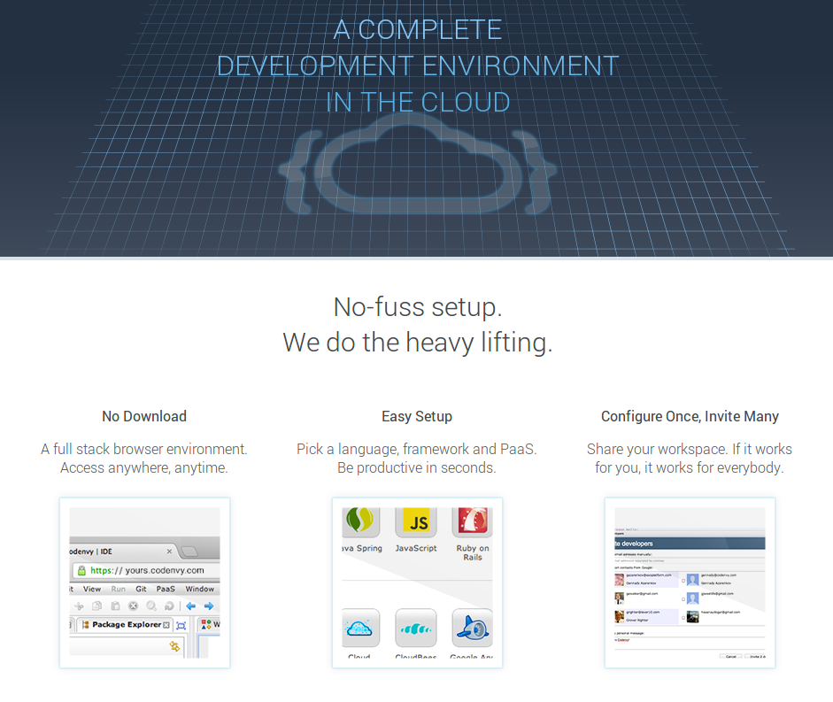
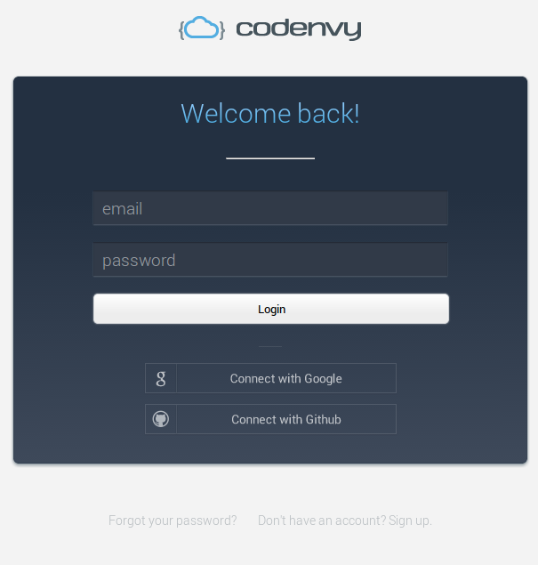
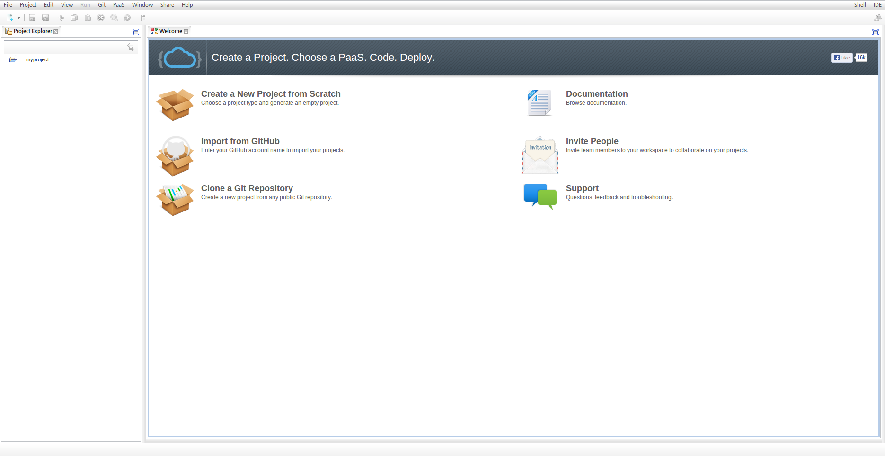

About Openshift
=================

* 발표자 : 김지헌

# OPENSHIFT
* [사이트](https://www.openshift.com)
* [Openshift github](https://github.com/openshift)

# Architecture Overview
* [Architecture Overview](https://www.openshift.com/wiki/architecture-overview)

## OpenShift Origin

## Platform Overview


* **Broker** : 애플리케이션 관리 활동의 접점
	* 사용자의 로그인, DNS, 애플리케이션 상태, 애플리케이션에 대한 협업 관리
	* 사용자는 브로커에 직접 접근할 수 없음
	* Broker와 REST API를 이용하여 웹콘솔, CLI tools 혹은 JBoss tools를 통해 통신
	   - [Client Tools](https://www.openshift.com/developers/tools)
    	   - [Web Console](https://openshift.redhat.com/app/console/applications)
    	   - [Install OpenShift RHC Client Tools](https://www.openshift.com/developers/rhc-client-tools-install)
    	   - [JBoss DevStudio](https://devstudio.jboss.com/download/6.x.html)
    	   - [REST API](https://access.redhat.com/site/documentation/OpenShift/?locale=en-US)
	   
* **Catridges**
    * [Catridge Author's Guide](https://www.openshift.com/developers/cartridge-authors-guide)
	* 사용자 애플리케이션에 필요한 기능들을 제공
	* JBoss, PHP, Ruby 등 많은 언어 카트리지 지원
	* Postgres, MySQL, MongoDB 등 많은 DB 카트리지 지원

### System Resources and Application Containers


* **Gear**
	* 한개 혹은 그 이상의 카트리지를 컨테이너에 주입하여 실행하도록 함
	* 카트리지의 디스크와 램의 사용공간을 제한
* **Node**
	* 자원 공유,
	* 단일의 물리적인 혹은 가상의 머신에서 실행되는 다수의 기어즈Gears의 자원을 공유할 수 있도록 함
	* 모든 응용프로그램이 동시에 활성화되기 때문에 일반적으로 기어는 노드에 과도하게 할당된다.

### Applications


* **Domain**
	* DNS와 직접 연결되지 않음
	* 사용자들의 애플리케이션들은 고유한 네임스페이스namespace를 제공
		- 네임스페이스 생성방식은?
	* 도메인명은 애플리케이션 이름 다음에 정해진 애플리케이션 URL이 붙는다.
* **Application Name**
	* 식별가능한 애플리케이션의 이름
	* **https://[app name]-[domain].rhcloud.com**
* **Aliases**
	* 사용자는 플랫폼에 앨리어스를 등록하고 DNS 이름으로 접근가능
* **Application dependencies**
    > 사용자들은 애플리케이션이 실행되는데 필요한 카트리지 지정가능
	* **Framework catridges**
	   - 웹서비스를 위한 기본 카트리지, 모든 애플리케이션이 반드시 가지고 있어야 함
	* **Embedded cartridges**
	   - DB 혹은 DB 웹인터페이스와 같은 카트리지 제공, 임베디드 카트리지들은 독립 애플리케이션으로 추가할 수 있음
* **Application GIT Repository**
    > 각 애플리케이션에는 깃 저장소를 제공, 사용자는 저장소의 코드를 수정하고 푸쉬하고 배포 가능

* 노트
    > 조만간, 프레임워크대 임베디드 카트리지의 개념은 사라질 계획. 함께 확장되는 형태로 발전해갈 것임

*****

## 사용자 기본 동작Primary user interactions
### 1. Simple Application Creation


1. 사용자가 애플리케이션 생성 요청
2. 인증
3. 기어 생성
4. 애플리케이션 DNS 엔트리 설정
5. Catridge 설정
6. Git 저장소 설정
7. CLI 툴을 이용하여 애플리케이션 깃 저장소 클론
8. 사용자가 깃을 이용하여 코드 배포

### 2. 젠킨스를 이용한 애플리케이션 배포Application deployment using Jenkins
> 오픈시프트는 젠킨스를 바탕으로 하는 모든 애플리케이션을 위한 워크플로우를 제공한다. 젠킨스 서버는 사용자 기어들 중에서 하나를 사용하여 분리된 애플리케이션을 실행한다. 사용자 빌더 에이전트는 분리된 애플리케이션을 SSH/REST API를 이용하여 브로커 통신하며 실행하고 애플리케이션을 구축한다. 


1. 사용자가 깃을 이용하여 코드를 애플리케이션에 배포
2. 애플리케이션이 빌드 요청을 발신
3. 젠킨스는 브로커에 접근하여 신규 빌더를 요청
4. 신규 빌더 생성 
5. 젠킨스 슬레이브 구축
6. 빌더 저장소 복제
7. 빌드 완료
8. 빌더 애플리케이션에 복제
9. 빌더가 젠킨스 서버에 artifact 발송

### 3. 수평적 확장Horizontal scaling (Beta)
> 애플리케이션의 수평적 확장은 로드밸런스load-balance로 HAProxy를 이용한다. 그리고 애플리케이션을 위한 깃 배포를 제공한다. HAProxy에 웹 요청이 수신되면, 애플리케이션의 웹티어에서 실행되고 있는 기어에 전달한다. 배포는 HAProxy 카트리지에 의해서 제어된다. 사용자가 HAProxy 기어에 코드를 깃 푸쉬했을 때, HAProxy는 다른 웹 기어들에 깃 푸쉬를 한다.  


### 4. 애플리케이션에서 사용되는 디스크립터 설명Describing an application using descriptiors
> 애플리케이션 디스크립터는 애플리케이션 구축하는 방법을 확정적인 방법을 제공한다. 디스크립터는 이름, 버전, 의존성 등에 대한 속성들과 애플리케이션의 아키텍쳐에 대한 내용을 포함하는 YAML 파일이다. 브로커/컨트롤러는 애플리케이션을 생성하거나 변경하는데 디스크립터 YAML을 이용할 수 있으며 수많은 유틸성 REST API는 디스크립터의 필드를 조작할 수 있다. 


> 디스크립터를 통해 애플리케이션을 구축할 때, 브로커는 디스크립터를 읽고 의존성을 해결한다. 각 의존성은 카트리지에 포함된 카트리지 디스크립터의 의존성까지 포함한다. 애플리케이션 디스크립터와 유사하게, 카트리지 디스크립터는 카트리지에 정의된 컴포넌트와 기능을 지원한다.
> 애플리케이션과 카트리지 디스크립터를 사용하면, 브로커는 함께사용할 컴포넌트를 조직하고 사용할 기어들을 결정한다. 

*****

## Logical views


### Packaging Structure
* [packaging structure](https://www.openshift.com/wiki/packaging)

### StickShift
* the core API part of the OpenShift Origin platform. PaaS 플랫폼을 생성하고 카트리지를 개발하는데 필요한 기본적인 모든 API를 제공한다. 

1. **Controller**
    - REST API, 비즈니스 로직과 PaaS platform 을 위한 상태 관리기능 포함한 Rails 엔진(Plugin)    
    - DNS 관리, 인증, Data/상태 스토리지, 브로커-노드 통신 플러그인 API를 포함
2. **Node**
    - 기어와 애플리케이션 생명주기를 관리하는데 필요한 API 포함
3. **Common**
    - 컨트롤러와 노드 컴포넌트에 의해 사용되는 데이터 스트럭쳐 포함

### Proxy ports


> 프록시 포트는 로드 밸런싱 혹은 애플리케이션 기어의 관계된 서비스를 제공하는 목적의 내부 서비스를 노출시킨다.
> 각 기어는 5개의 프록시 포트를 사용가능하다. 독립된 노드에 기어가 존재한다면 우회하는 주소를 제공한다. 
> 프록시 포트는 HAProxy는 시스템 서비스를 실행하고 TCP 커넥션 프록시 설정이 가능하다. HAProxy 카트리지는 웹 로드 밸런싱 서비스를 제공한다. 조만간 애플리케이션 디스크립터의 기술된 TCP 커넥션의 사용을 근간으로 하는 메커니즘을 사용가능해질 것이다.

> 프록시 포트는 외부에서 노드 집합에 직접 접근할 수 없다. 

### Gear fileSystem layout
```
.                                               
├── git
# Gears git repository. Initially populated by the web-framework cartridge
│   └── [APP_NAME].git
|       |
# The hook directory is the only one owned by root to prevent users from modifying it
│       ├── hooks								 
|       |   |                                   
|       |   |                                   
│       │   └── pre-receive
# Post receive hook invokes the build and deployment
│       └── ... other git directories           
└── [APP_NAME]
# CI directory is used by Jenkins to clone and build the application.
    ├── ci				
# Control script to start/stop application when node is restarted						
    ├── kraman3a_ctl.sh
    ├── <cartridge name>                        
    │   └── <cartridge specific configuration>  
    ├── data                                    
    │   └── ... ephemeral data storage          
    ├── run                                     
    │   └── ... PID files for processes         
    ├── logs                                    
    │   └── ... log files for all cartridges    
    ├── sessions                                
    │   └── ... application session information 
    ├── tmp                                     
    │   └── ... application temporary data      
    ├── repo -> runtime/repo                    
    └── runtime                                 
        └── repo      
# Platform support for dependency management for cartridges such as php which dont have their own
            ├── deplist.txt						
            |                                   
            ├── ... deployed application code   
            └── README  
```

******

## Descriptors

### Application Descriptiors
> 사용자가 애플리케이션 디스크립터를 생성시 의존성, 아키텍쳐 스케일링과 애플리케이션 연결을 어떻게 정의하는지 설명한다.

#### Terms
* Name(필수) : 애플리케이션명
* Version(선택) :  애플리케이션 버전
* Requires : 의존성 목록, 카트리지 이름 혹은 요소
* Cartridge : 컴포넌트 패키지 묶음
* Component : 소프트웨어 패키지 묶음, 사용자가 이 레벨에 대해 알 필요는 없다.
* Connections :  서로 다른 컴포넌트의 관계 정의, PHP와 MySQL은 직접적인 관계는 없지만, 서로를 필요로 한다.
* Group Override : 관련없는 카트리지를 동일한 기어에서 그룹화하여 사용함. 이 컴포넌트들은 함께 확장됨
* Gear : 컴포넌트가 실행되는 CPU, 메모리, 디스크 유닛(AWS의 인스턴스?)

#### Simple descriptor
```
Name: myapp
Version: 1.0
Requires: php-1.0, mysql, mongodb
Connections:
  - php-1.0, mysql
  - php-1.0, mongodb
Group override:
  - php-1.0, mysql
```

"myapp"이라는 이름의 애플리케이션 디스크립터를 살펴보면, php-1.0, mysql과 mongodb에 대한 의존성을 가지고 있다. PHP, MySQL과 PHP, MongoDB는 서로 통신수단을 필요로 한다. PHP와 MySQL 은 MongoDB가 기어셋으로 실행되는 동안 동일한 묶음으로 실행된다. 

### Cartridge descriptors
> 파트너/카트리지 개발자들이 카티리즈들의 속성을 서술한다. 애플리케이션 개발자들의 시스템에 대한 그들의 관점은 다르고 발전된 기능을 노출한다.

#### 조건들Terms
* Version, Vendor, License : 메타정보 필드는 시스템이 직접 사용되지는 않음
* Require native : 플랫폼 패키지 의존성들(RPM)
* Provides : 카트리지에서 제공하는 요소 목록
* Profile : 소프트웨어의 동일한 부분에서 다른 아키텍츠를 제공하는 프로파일 안에서 컴포넌트를 그룹화할 수 있다. 
* Publisher : 컴포넌트로 부터 커넥션 최종점에서 목록에 연결...?
* Subcribers :
* Connection types :
* Groups :
* ComponentRef :
* Configure-Order :
* Start-Order : 

#### Example descriptor
```
Name: myapp
Version: 1.0
Requires: php-1.0, mysql, mongodb
Connections:
  - php-1.0, mysql
  - php-1.0, mongodb
Group override:
  - php-1.0, mysql
```

"mysql-server" 디스크립터는 mysql 속성을 정의하고 이다. RPM에 의해 설치 되고 실행된다. 두 개의 프로파일(simple 과 master-master)을 제공하고 있다. simple profile은 "master"라는 이름의 "NET:TCP:JDBC" 형식의 퍼블리셔Publisher 컴포넌트를 가지고 있다.

#### Connector type
> 각 커넥션(publisher와 subcriber)는 반드시 연결유형이 정의되어야 한다. 이 유형은 콜론(:)에 의해 분리된다. Cloud-SDK 사전 정의된 유형을 가지고 있다.

* NET:TCP - 호스트명, 포트
* NET:UNIX - 유닉스 소켓 경로
* FILESYSTEM - 로컬 파일시스템 경로 
* FILESYSTEM:SHARED - 클러스터 파일시스템 자원 경로 

#### Connector Establishment
> 컴포넌트를 가동 혹은 정지시키며 설정하는 동안 퍼블리셔 연결체는 기어마다 있는 컴포넌트의 정보를 이용하여 연결한다. 기어에 있는 컴포넌트의 임무 : 애플리케이션에 의해 카트리지가 사용될 때, 컴포넌트는 동일하거나 다른 기어 세트에 의존한다.

* 동일한 카트리지와 카트리지 디스크립터에서 필요로 하는 동일한 그룹이라면 컴포넌트들은 동일한 기어에 위치할 것이다. 
* 커넥션이 NET:UNIX, FILESYSTEm or NET:TCP:INTERNAL 유형 사이에 연결되어 있다면 컴포넌트들은 동일한 기어에 위치할 것이다.
* 카트리지 혹은 애플리케이션 디스크립터가 그룹 오버라이드 필에 함께 등록되어 있다면 컴포넌트들은 동일한 기어에 위치할 것이다.

### Runtime resolution of application/cartridge descriptiors
> Cloud-SDK가 애플리케이션을 구성하는데 디스크립터를 사용하고 의존성과 기어에 어떻게 할땅하는지 설명한다.

#### Terms (Runtime state stroage on broker)
> 실행계급runtime hierarchy는 애플리케이션 디스크립터와 카트리지 디스크립터로 부터 정보를 이용하여 동화과정에서 생성된다. 

* Component Instance 
    - 카트리지들과 애플리케이션 디스크립터를 이용하여 컴포넌트들을 생성
    - 카티리지의 계정, 프로파일, 컴포넌트 명을 생성
* Group Instance 
    - Component Instance와 유사함, 카트리지와 애플리케이션 디스크립터들에 대한 그룹들을 생성
    - 프로피알와 카트리지를 추적
* Gear

#### Terms(Runtime models on node)
* ApplicationContainer : Cloud-SDK 측면의 노드 재현
* UnixUser : Cloud-SDK 측면의 유닉스 사용자 노드 재현

#### Descriptor Elaboration
> 디스크립터가 동화되는 단계는 연계된 2단계를 거친다.

* 모든 의존성을 해결하고 컴포넌트 인스턴스와 그룹 인스턴스의 실행 구조체를 생성
* 커넥션과 그룹 오버라이드Group override를 바탕으로 그룹들 연결

*****

## Developer center

### Technology Cartridge
* Support language
	* [Java](https://www.openshift.com/developers/java)
	* [PHP](https://www.openshift.com/developers/php)
	* [Perl](https://www.openshift.com/developers/perl)
	* [Ruby](https://www.openshift.com/developers/ruby)
	* [Node.js](https://www.openshift.com/developers/node-js)
	* [Python](https://www.openshift.com/developers/python)
* support database
	* [MySQL](https://www.openshift.com/developers/mysql)
	* [PostgreSQL](https://www.openshift.com/developers/postgresql)
	* [MongoDB](https://www.openshift.com/developers/mongodb)

### QuickStarts
* Git Repository 에서 소스코드를 복제하여 애플리케이션을 생성하여 배포

### Documentation
* [OpenShift REST API guide](https://www.openshift.com/sites/default/files/documents/OpenShift_Online-2.0-REST_API_Guide-en-US.pdf)
* [OpenShift User Guide](https://www.openshift.com/sites/default/files/documents/OpenShift_Online-2.0-User_Guide-en-US_1.pdf)
* [OpenShift Client Tools installation Guide](https://www.openshift.com/sites/default/files/documents/OpenShift_Online-2.0-Client_Tools_Installation_Guide-en-US_0.pdf)
* [OpenShift Release Notes](https://www.openshift.com/sites/default/files/documents/OpenShift-2.0-Release_Notes-en-US_1.pdf)

*****
## [CodeEnvy.org](https://codenvy.com/)에서 OpenShift으로 기본 애플리케이션 배포하기

### CodeEnvy 개요Feature



### 배포 순서
1. codenvy.org 로그인<br/>
<br/>
2. create a new project from scratch<br/> 
<br/>
3. openshift 선택<br/>
4. 배포