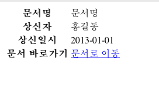
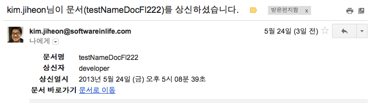

Thymeleaf 간략 소개
==============

> Java 기반의 XML, XHTML, HTML5 지원 템플릿 엔진

### 유사 템플릿 엔진
* [StringTemplate](http://www.stringtemplate.org/)
* [Velocity](http://velocity.apache.org/)
* [FreeMarker](http://freemarker.sourceforge.net/)

### 도입목적
* 기존 프로젝트에서 결재관련 메일발송시 본문을 StringBuilder를 이용하여 태그를 문자열로 입력하고, 조합하는 모습을 보고 Template engine의 도입을 시도해봤습니다.
* 가급적이면 Html을 그대로 이용할 수 있는 엔진 모색
* 누군가의 추천
* 간단한 사용모습을 보고서 도입시도
	* 4시간의 삽질!
	* 포기!
	* 재도전! 1시간만의 문제해결!
		- '\' 하나 때문에...!

### 도입전

```
StringBuilder sb = new StringBuilder();
sb.append("<html>");
sb.append("<head><title>test</title></head>");
sb.append("<body>" + repoerter + "<br/>");
sb.append("</body></html>");
```

### 도입후
* ThymeleafMailMessage

```
@Data
public class MailMessage {

	private String from; // 보내는 사람
	private String to; // 받는 사람
	private String subject; // 제목
	private String text; // 내용
	private Date sendDate = Calendar.getInstance().getTime(); // 보내는 날짜

	private Set<File> attachments = Sets.newHashSet(); // 첨부파일
	private String encoding;
	private boolean htmlContent = true; // 내용의 유형이 HTML이면 true

	
	
	public MailMessage() {
	}

	public MailMessage(String from, String to, String subject, String text) {
		this.from = from;
		this.to = to;
		this.subject = subject;
		this.text = text;
	}

	public MailMessage(String to, String subject, String text) {
		this.to = to;
		this.subject = subject;
		this.text = text;
	}

	public MailMessage addAttachment(File file) {
		if (file != null)
			attachments.add(file);

		return this;
	}

	public MailMessage removeAttachment(File file) {
		if (file != null)
			attachments.remove(file);

		return this;
	}

	public Set<File> getAttachments() {
		return Collections.unmodifiableSet(attachments);
	}

	public boolean isMultipart() {
		return !attachments.isEmpty();
	}
}
```

```
@ToString(callSuper=true)
public class ThymeleafMailMessage extends MailMessage {

	@Getter
	private final String templateName;
	private final Map<String, Object> attributes = Maps.newHashMap();
	
	
	
	public ThymeleafMailMessage(String templateName) {
		this.templateName = templateName;
	}
	
	public ThymeleafMailMessage addAttribute(String key, Object value) {
		this.attributes.put(key, value);
		return this;
	}
	
	public ThymeleafMailMessage removeAttribute(String key) {
		this.attributes.remove(key);
		return this;
	}
	
	/**
	 * @return 읽기전용 attribute
	 */
	public Map<String, Object> getAttributes() {
		return Collections.unmodifiableMap(attributes);
	}
}
```

* MailServiceImpl

```
try {
	MimeMessage mimeMessage = new MimeMessage(Session.getInstance(System.getProperties()));
	MimeMessageHelper helper = null;
	if(StringUtils.hasText(message.getEncoding())) {
		helper = new MimeMessageHelper(mimeMessage, message.isMultipart(), message.getEncoding());
	} else {
		helper = new MimeMessageHelper(mimeMessage, message.isMultipart());
	}
	
	helper.setTo(message.getTo());
	helper.setFrom(message.getFrom());
	helper.setSubject(message.getSubject());
	helper.setText(message.getText(), message.isHtmlContent());
	helper.setSentDate(message.getSendDate());
	
	smtpTransport.sendMessage(mimeMessage, mimeMessage.getAllRecipients());
} catch (Exception e) {
	logger.error(e.getMessage());
}
```

* ThymeleafMailMessage 작성예

```
ThymeleafMailMessage mailMessage = new ThymeleafMailMessage("reportDocument");
mailMessage.setEncoding("UTF-8");	// Mail encoding type
mailMessage.setFrom(user.getUserEmail()); // from
mailMessage.setTo(user.getUserEmail());	// to
mailMessage.setSendDate(new Date());
mailMessage.setSubject(messageSourceAccessor.getMessage("mail.title.document-report",
		new String[] { user.getName(), document.getName() })); // title
// 메일에 입력될 필드값들
mailMessage.addAttribute("reporterName", user.getName());
mailMessage.addAttribute("documentName", document.getName());
mailMessage.addAttribute("alternateLink", document.getGoogleDriveFile().getAlternateLink());
mailMessage.addAttribute("reportDate", mailMessage.getSendDate());
return mailMessage;
```

* reportDocument.html 작성예

```
<!DOCTYPE html>
<html xmlns:th="http://www.thymeleaf.org">
    <head>
        <title th:remove="all">${documentName} - 상신자 : ${reporterName}</title>
        <meta http-equiv="Content-Type" content="text/html; charset=UTF-8" />
    </head>
    <body>
    	<table>
    		<tbody>
   			<tr>
    			<th>문서명</th>
    			<td th:text="${documentName}">문서명</td>
   			</tr>
   			<tr>
    			<th>상신자</th>
    			<td th:text="${reporterName}">홍길동</td>
   			</tr>
   			<tr>
    			<th>상신일시</th>
    			<td th:text="${#dates.format(reportDate)}">2013-01-01</td>
   			</tr>
   			<tr>
    			<th>문서 바로가기</th>
    			<td><a href="#" th:href="${alternateLink}">문서로 이동</a></td>
   			</tr>
    		</tbody>
    	</table>
    </body>
</html>
```

* reportDocument.html을 브라우저에서 열었을 경우

* 실제로 적용된 경우
